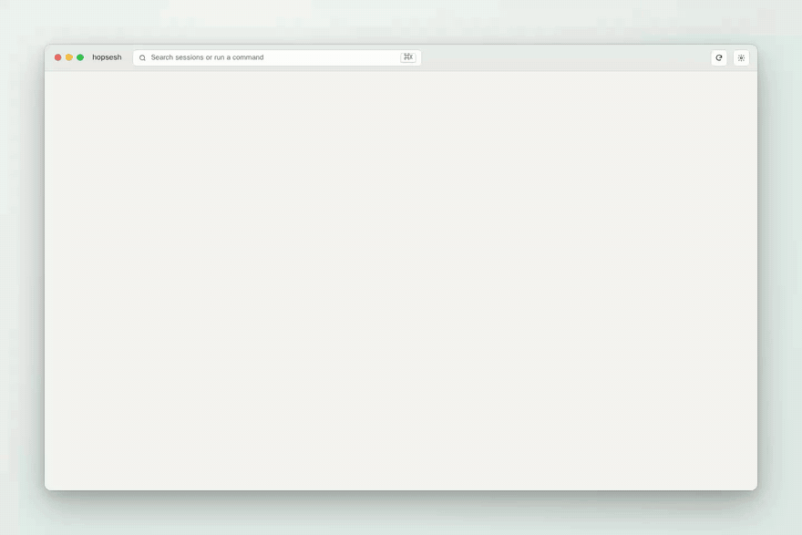
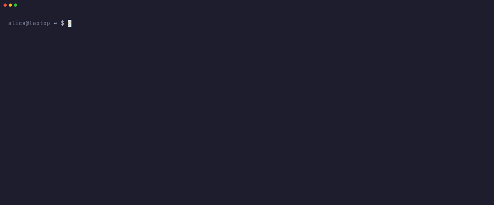
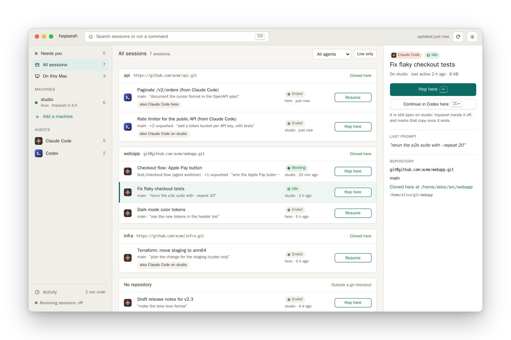
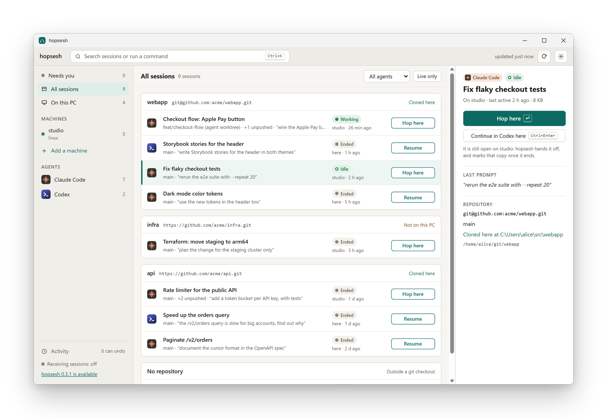
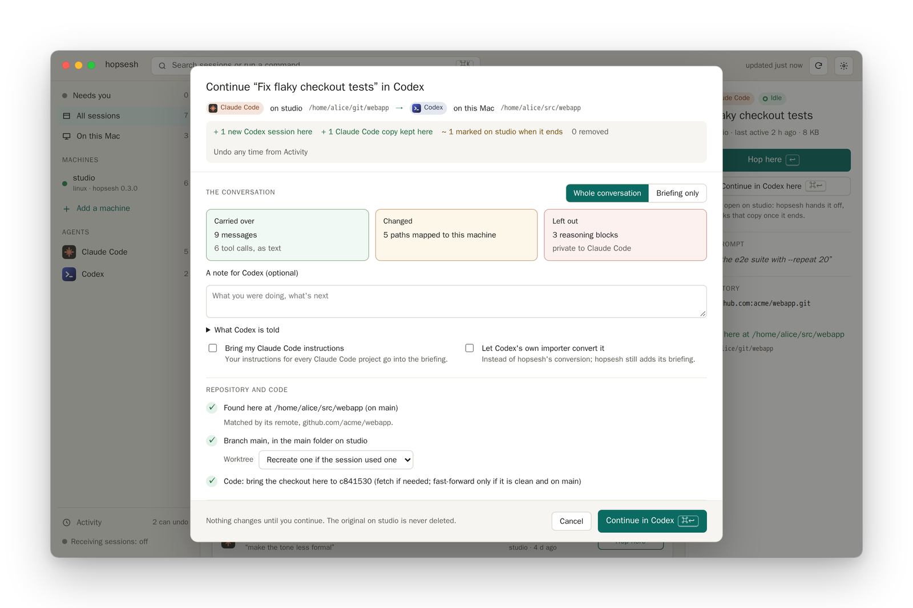
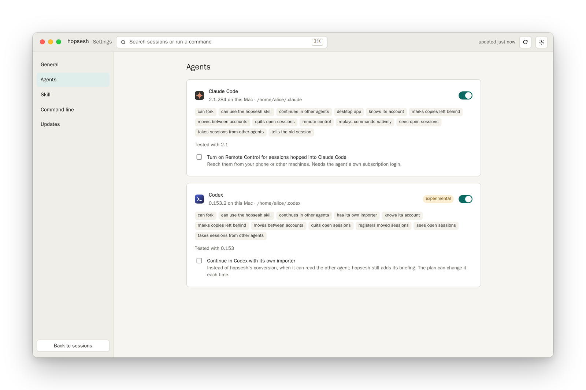

<div align="center">


# hopsesh

**Move coding-agent sessions between your machines, and between Claude Code and Codex.**

[](https://github.com/roeehrl/hopsesh/releases/latest)
[](https://github.com/roeehrl/hopsesh/actions/workflows/ci.yml)
[](https://scorecard.dev/viewer/?uri=github.com/roeehrl/hopsesh)
[](https://pkg.go.dev/github.com/roeehrl/hopsesh)
[](LICENSE)


[Install](#install) · [Quick start](#quick-start) · [Another agent](#continue-in-another-agent) · [Round trips](#round-trips) · [Push](#send-a-session-to-another-machine) · [Ask your agent](#use-it-from-your-agent) · [Why not…?](#why-not) · [FAQ](#faq)

<picture>
  <source media="(prefers-color-scheme: dark)" srcset="docs/assets/hero-dark.gif">
  
</picture>

<sub>The macOS app, recorded with made-up machines and sessions (<a href="demo/README.md">demo/</a>).</sub>

</div>

You started something in Claude Code on your desktop, and now you're on your laptop, or you
want Codex to take over. hopsesh shows every session of every agent on all your machines and
brings the one you pick here: in the same agent, or continued in the other one, with the
repository, worktree and paths fixed up. Then it gives you the command to continue.

- **Finds your machines** from Tailscale and `~/.ssh/config`, and connects only to the ones you
  allow, with your own `ssh`, keys and agent. Nothing to install on the other machines.
  Machines without SSH keys can log in with a password.
- **Lists every session of every agent** (Claude Code and Codex) by repository: machine, agent,
  path, branch, worktree, last prompt, last activity, whether it's running, and where else
  it has been.
- **Moves a session safely**: finds the repo here or clones it, recreates the worktree, brings
  the code to the session's commit, rewrites paths, and shows a plan first. `hopsesh undo`
  reverses it.
- **Continues it in another agent**: `--in codex` or `--in claude`, on another machine or this
  one. The plan shows exactly what carries over and what doesn't, plus the briefing the other
  agent gets.
- **Comes back intact**: a round trip adds only the new work to the original session, so a
  Claude Code session's earlier turns, including its signed reasoning, stay byte for byte.
  If both copies changed, it stops and asks; it never merges.
- **Works from inside your agent**: ask Claude Code or Codex "bring my laptop session here" and
  it plans with hopsesh, then moves only after you say yes.
- **CLI, TUI and a desktop app for macOS and Windows** on one engine, with `--json` output
  everywhere it matters. The apps update themselves.

> Status: alpha. It works end to end on macOS and Linux, and the Windows app and installer are
> tested in CI on Windows Server 2025, including the real window. hopsesh is an independent
> project, not affiliated with Anthropic or OpenAI.

## Install

macOS and Linux:

```sh
curl -fsSL https://raw.githubusercontent.com/roeehrl/hopsesh/main/scripts/install.sh | sh
```

Windows (PowerShell):

```powershell
irm https://raw.githubusercontent.com/roeehrl/hopsesh/main/scripts/install.ps1 | iex
```

Both check the download against the release's `checksums.txt` and its signature, and
`hopsesh update` installs later releases with the same checks.

- **macOS app:** [download the signed, notarized `.dmg`](https://github.com/roeehrl/hopsesh/releases/latest/download/hopsesh-macos-universal.dmg)
  (macOS 13+, Apple silicon and Intel).
- **Windows app:** [download the installer](https://github.com/roeehrl/hopsesh/releases/latest/download/hopsesh-windows-amd64-setup.exe)
  (Windows 10/11; [arm64](https://github.com/roeehrl/hopsesh/releases/latest/download/hopsesh-windows-arm64-setup.exe)).
  It installs for your user only, no administrator rights, and adds the `hopsesh` command to
  your PATH. The installer isn't code-signed yet, so Windows SmartScreen says "Windows
  protected your PC": click **More info**, then **Run anyway**. A portable `.zip` of the app
  is on the [release page](https://github.com/roeehrl/hopsesh/releases/latest).
- **Linux packages:** `.deb`, `.rpm` and `.apk` for amd64 and arm64 are on the
  [release page](https://github.com/roeehrl/hopsesh/releases/latest), for example
  `sudo apt install ./hopsesh_<version>_linux_amd64.deb`.
- **From source** (Go 1.26+): `go install github.com/roeehrl/hopsesh/cmd/hopsesh@latest`

The other machines need only an SSH server (Remote Login on macOS, OpenSSH on Windows) and
their sessions. To continue in another agent, that agent must be installed here.

## Quick start

```sh
hopsesh hosts                 # machines found in Tailscale and ~/.ssh/config (connects to nothing)
hopsesh hosts allow studio    # let hopsesh connect to one
hopsesh trust studio          # confirm its SSH host key
hopsesh                       # browse sessions and move one here
```



<sub>Recorded with <a href="https://github.com/charmbracelet/vhs">VHS</a> from <a href="demo/hopsesh.tape">demo/hopsesh.tape</a>.</sub>

A session is named `[<machine>:][<agent>/]<id-or-title>`. Leave out the machine to take the
newest copy anywhere, and leave out the agent when the title or id is unambiguous.

```sh
hopsesh agents                                 # supported agents and what's installed here
hopsesh ls --agent codex --json                # sessions of one agent, grouped by repo
hopsesh plan studio:"fix flaky tests"          # read-only preview of a move
hopsesh pull studio:"fix flaky tests"          # plan, confirm, move, print the command
hopsesh pull studio:claude/7f3c2a1e --in codex # continue a Claude Code session in Codex
hopsesh pull 7f3c2a1e                          # no machine name: bring back the newest copy
hopsesh push 7f3c2a1e laptop                   # send it to a machine that runs hopsesh
hopsesh hosts add nas alice@192.168.1.20 --password   # a machine without SSH keys
hopsesh doctor studio                          # agents, SSH, host trust and the skill
hopsesh undo                                   # undo the newest move (--list shows more)
```

### The app

<picture>
  <source media="(prefers-color-scheme: dark)" srcset="docs/assets/app-dark.png">
  
</picture>

Same engine, with a plan sheet for each move: repository, worktree mode, what gets
rewritten, and what's left behind on the other machine. Every session has **Continue in…**,
with a preview of the conversion, and sessions on this machine have **Send to…** another
machine: it plans there, carries it out, and one Undo reverses both sides. Settings has per-agent options and a **Receive sessions**
switch. It can also put the `hopsesh` command on your PATH (no administrator password) and
install the skill into your agents.

The app is the same on macOS and Windows; on Windows it says "this PC", uses Ctrl where macOS
uses ⌘, opens sessions in Windows Terminal (or PowerShell) and keeps passwords in Windows
Credential Manager. It updates itself: **Settings → Updates → Install and restart** checks
the release's signature and checksum (on macOS also the Apple developer and notarization),
installs it and reopens.

<picture>
  <source media="(prefers-color-scheme: dark)" srcset="docs/assets/windows-app-dark.png">
  
</picture>

## Continue in another agent

```sh
hopsesh plan studio:"fix flaky tests" --in codex   # see what carries over, change nothing
hopsesh pull studio:"fix flaky tests" --in codex   # then do it
```

<picture>
  <source media="(prefers-color-scheme: dark)" srcset="docs/assets/plan-dark.png">
  
</picture>

hopsesh converts the conversation into the other agent's own session format, on another
machine or this one:

- **`--fidelity history`** (the default) brings the conversation as text. Tool activity is
  labelled as the previous agent's, long outputs are shortened, and the oldest steps are
  summarised when the history is long.
- **`--fidelity note`** brings only a briefing.
- **`--native`** (experimental) replays exact shell calls as the target agent's own, where it
  can.
- **`--via import`** lets Codex's own importer convert a Claude Code session; hopsesh adds its
  briefing and keeps it undoable.

Every plan shows a **loss report** (what was kept, what was shortened or summarised, which paths
were mapped; reasoning from the other vendor is never carried). It also shows the **briefing**
the other agent gets: where the session came from, what to verify first (git status, the
commit at transfer time), the open plan, and instruction files only the previous agent read.
`--note-file` adds your own handoff note, `--carry-rules` adds your instructions for every
project, and `--go` starts the session with "Continue." Nothing is sent to a model unless you
start it. Details: [docs/design.md §8](docs/design.md#8-continuing-in-another-agent).


## Round trips

Move a session to your laptop, or into Codex, work on it, and bring it back later:

- **The copy left behind is marked** in its agent's own list: `↪ moved to <machine> · <title>`
  or `↪ continued in Codex on <machine> · <title>`.
- **One row per session.** Listings combine the copies of a session across machines and
  agents. `hopsesh pull <id-or-title>` without a machine name brings back the newest one,
  into the folder it came from.
- **Coming back to the original agent adds only the new work.** The original session's own
  turns, including Claude Code's signed reasoning, stay byte for byte.
- **It never merges.** If both copies changed, the move stops until you choose `--keep-both`
  (a separate session) or `--replace` (the copy here is set aside; `hopsesh undo` brings it
  back).
- **The code follows.** hopsesh fetches the session's commit, straight from the other machine
  if it was never pushed, and fast-forwards a clean checkout. It never merges, rebases or
  stashes; otherwise it says exactly what's missing.
- **The history travels with the session.** A small `<session>.hopsesh.json` beside it records
  its copies and hops, so the next move works from any machine.

Details: [docs/design.md §10](docs/design.md#10-round-trips-and-lineage) and
[§12](docs/design.md#12-code-follows-the-conversation).

## Send a session to another machine

`pull` needs only SSH on the other machine. When that machine runs hopsesh too, you can also
send a session from here:

```sh
hopsesh receive on               # on the machine that receives (off by default)
hopsesh push 7f3c2a1e laptop     # on the machine that has the session
```

The receiver plans with its own agents and settings against a read-only copy of that
session's files; it can't read or run anything else on the sender. Nothing changes until you
confirm, and `hopsesh undo` on the sender reverses both machines. Both sides must speak the same
hopsesh protocol version; otherwise hopsesh asks you to update. Details:
[docs/design.md §11](docs/design.md#11-peers-working-with-hopsesh-on-the-other-machine).

## Use it from your agent

```sh
hopsesh skill install              # your agent asks before each hopsesh command
hopsesh skill install --add-rules  # read-only hopsesh commands run without asking
```

The skill goes into every installed agent (Claude Code and Codex) as identical files. Then ask
things like "bring my laptop session here", "continue this in Codex" or "which sessions are
running on the studio?". The agent plans first and **moves only after you say yes**.
`--add-rules` lets the read-only commands (`ls`, `show`, `plan`, `agents`, `doctor`, …) run
without asking, while `pull`, `push` and `undo` **always ask**, even in auto mode. The skill
never starts another agent and never handles passwords: for a machine that logs in with a
password, the agent asks you to run `hopsesh hosts setup-key` yourself. `hopsesh skill remove`
takes it out again. Details: [docs/design.md §13](docs/design.md#13-the-hopsesh-skill-for-every-agent)
and [§14](docs/design.md#14-the-command-line-tool-from-the-app).

## How it works

1. **Discovery** reads `tailscale status --json` and your `~/.ssh/config`. It connects to
   nothing until you allow a machine.
2. **Listing** connects with your system `ssh` (strict host-key checking, ControlMaster) and
   reads the head and tail of each transcript over SFTP. One batched `git` probe per machine
   adds branch, worktree and unpushed/uncommitted counts.
3. **Moving** builds a plan, then copies the session's files into a staging folder. It
   rewrites paths in one pass, so ids, signatures and encrypted content are never touched.
   It checks the result, installs it where the agent looks for it, and keeps an undo
   journal.
4. **Continuing in another agent** reads the session into a neutral form (a chain of
   content-hashed steps), then writes it in the other agent's format with the loss report
   and briefing.

Each agent is a module behind a small SDK, so adding one doesn't touch the core. The details,
including the file-format traps hopsesh handles, are in [docs/design.md](docs/design.md).

### How it treats your data

- **Your machines only.** Sessions travel over your own SSH. There's no hopsesh server, no
  cloud relay and no telemetry. The app can check GitHub once a day for new versions, only
  if you say yes.
- **Read-only until you say go.** Each machine needs your permission, and every move is shown
  as a plan first.
- **Never moves credentials.** Logins, keys, live sockets and account data stay where they
  are; each machine stays signed in on its own. A machine's SSH password is kept in
  the macOS Keychain or Windows Credential Manager, or asked for each time, and never written
  to hopsesh's files or a command line.
- **Transcripts can hold secrets.** hopsesh scans for likely secrets while moving and can
  redact the copy (`--redact`). Every remote action goes to a local audit log.
- **Only your agents talk to their models.** hopsesh never calls the Anthropic or OpenAI API.

## Why not…?

- **Codex's own import of Claude Code sessions?** It converts on one machine. hopsesh uses it
  when you ask (`--via import`) and adds machines, the repository, a loss report, a briefing
  and a way home that keeps the original session intact.
- **`claude --teleport`?** Teleport brings a session from Claude Code on the web to your
  machine. hopsesh moves sessions between your own machines.
- **Remote Control?** Remote Control lets you drive a session that keeps running where it
  is. hopsesh moves the session, so it continues on the machine you're at, with that
  machine's files and tools. It can turn Remote Control on for the moved session.
- **Copying the `.jsonl` and running `claude --resume`?** It works only if every path is the
  same on both machines, the project folder name matches Claude Code's naming rules, and
  there's no second copy of the session. hopsesh handles those cases, plus the repository,
  worktree, side files and undo.
- **Syncing all of `~/.claude` between machines?** Sync tools copy everything, all the time.
  hopsesh moves the one session you pick, when you pick it, and fixes it up for the new
  machine.

Related projects, with different trade-offs:
- [parcels](https://github.com/0xSero/parcels) ships a repository together with a live agent
  session over Tailscale.
- [go-claude-teleport](https://github.com/mithro/go-claude-teleport) moves a session, its git
  worktree and its tmux window over SSH.
- [claude-nomad](https://github.com/funkadelic/claude-nomad) syncs your setup and history
  with path remapping.
- [chronicle](https://github.com/geekmuse/chronicle) syncs history through git.
- [sessport](https://www.npmjs.com/package/sessport) converts sessions between agents on one
  machine.

## FAQ

<details>
<summary><b>Does anything leave my machines?</b></summary>

No. Sessions go directly between your machines over SSH. hopsesh has no server and no
telemetry, and it never calls the Anthropic or OpenAI API.
</details>

<details>
<summary><b>Do I need Tailscale?</b></summary>

No. Any machine you can `ssh` to works, including aliases, ProxyJump and ProxyCommand from
your `~/.ssh/config`. Tailscale just makes machines easy to find. When an alias's LAN name
doesn't resolve, hopsesh falls back to the machine's Tailscale name.
</details>

<details>
<summary><b>One of my machines logs in with a password, not an SSH key</b></summary>

Add it with `hopsesh hosts add <name> <destination> --password`, or switch an
existing one with `hopsesh hosts auth <machine> password`. In the app, use the "Login" button
on the Machines screen, or tick "This machine logs in with a password" when adding it.

hopsesh asks for the password when it connects:
- **On macOS and Windows** it remembers it in the Keychain or Windows Credential Manager by
  default (`--keychain=false` to be asked each time).
- **Otherwise** it asks with a hidden prompt in the terminal, or a dialog in the app.
- **In scripts**, `--password-stdin` reads it from standard input.

It's never written to hopsesh's files or put on a command line.

Better still, `hopsesh hosts setup-key <machine>` (in the app: "Set up key login") logs in once
with the password and adds your SSH key there. It then checks that key login works, switches
the machine to keys and forgets the password. This works for macOS and Linux machines.
`hopsesh hosts` shows each machine's login method. Details:
[docs/design.md §16](docs/design.md#16-password-login).
</details>

<details>
<summary><b>Does the other machine need hopsesh installed?</b></summary>

No. `pull` only needs an SSH server there. hopsesh on the other machine is needed only to
`push` from here to there (it must also run `hopsesh receive on`).
</details>

<details>
<summary><b>What gets lost when a session continues in another agent?</b></summary>

The plan tells you before anything is written. Usually the conversation arrives as text, tool
calls appear as the previous agent's activity, long outputs are shortened, and reasoning
from the other vendor is left out. When you bring the session back, only the new work is
added to the original, so nothing in the original is lost.
</details>

<details>
<summary><b>What if the session is still running on the other machine?</b></summary>

By default hopsesh copies it as it is and hands it off: the copy left behind is marked when
that session ends. With `--fork`, both copies continue independently. hopsesh refuses to
replace a session that's open on this machine, unless `--stop-local` quits it first. For
Codex that works only between turns, because Codex has no graceful way to stop mid-turn: if
it's working, hopsesh asks you to let it finish. Listings show running sessions as "live
working" or "live idle".
</details>

<details>
<summary><b>I moved a session and kept using the old copy too. What happens?</b></summary>

Moving it again stops and explains: both copies changed, and hopsesh never merges them. Choose
`--keep-both` to bring the incoming copy in as a separate session, or `--replace` to set the
copy here aside (`hopsesh undo` restores it).
</details>

<details>
<summary><b>Different usernames, home folders or operating systems?</b></summary>

That's the point. Paths are rewritten for the new machine, including JSON-escaped Windows
paths, and separators are converted between Windows and macOS/Linux. Paths it can't map are
left as they are and listed in the plan.
</details>

<details>
<summary><b>Different accounts on the two machines?</b></summary>

hopsesh asks each agent which account it's signed in to: `claude auth status` for Claude Code,
and Codex itself for Codex (its `auth.json` is never read). If the accounts differ, it leaves
out what only the original account can use: Claude Code's signed thinking blocks, and Codex's
encrypted reasoning and compaction records. These are removed whole, never edited, and the
conversation itself stays.
</details>

<details>
<summary><b>Why does macOS ask about "devices on your local network"?</b></summary>

macOS 15 and later ask before an app may reach machines on your LAN. The hopsesh app asks
when it first connects to such a machine, explains why, and if you chose Don't Allow, links to
System Settings → Privacy & Security → Local Network. Tailscale connections aren't affected,
and the command-line tool run from Terminal never needs this permission.
</details>

<details>
<summary><b>How do I undo a move?</b></summary>

`hopsesh undo` reverses the newest move or continuation, and `hopsesh undo <id>` a specific
one. It removes new files, restores replaced ones, cuts off appended records and brings back
set-aside copies, on other machines too. `hopsesh undo --list` shows what can be undone.
</details>

## Contributing

Contributions are welcome. Issues labelled
[good first issue](https://github.com/roeehrl/hopsesh/contribute) are a good place to start.
You don't need two machines: `demo/record.sh shell` starts two made-up machines in Docker and
drops you on one with hopsesh ready (see [demo/README.md](demo/README.md)).

See [CONTRIBUTING.md](CONTRIBUTING.md) for the 60-second dev setup, and use
[Discussions](https://github.com/roeehrl/hopsesh/discussions) for questions and ideas.
Report security issues privately as described in [SECURITY.md](SECURITY.md).

### Add your agent

<picture>
  <source media="(prefers-color-scheme: dark)" srcset="docs/assets/agents-dark.png">
  
</picture>

Every agent is a module behind a small SDK (`sdk/agent`): implement listing, bundling,
planning and resuming, add the capabilities your agent supports, and run the conformance
kit. Claude Code and Codex are the two templates. See
[Add an agent module](CONTRIBUTING.md#add-an-agent-module); OpenCode is an open
[help wanted](https://github.com/roeehrl/hopsesh/issues/10) issue.

## License

[Apache License 2.0](LICENSE). "Claude" and "Claude Code" are trademarks of Anthropic, PBC;
"Codex" and "OpenAI" are trademarks of OpenAI. hopsesh is not affiliated with, endorsed by or
sponsored by Anthropic or OpenAI.
