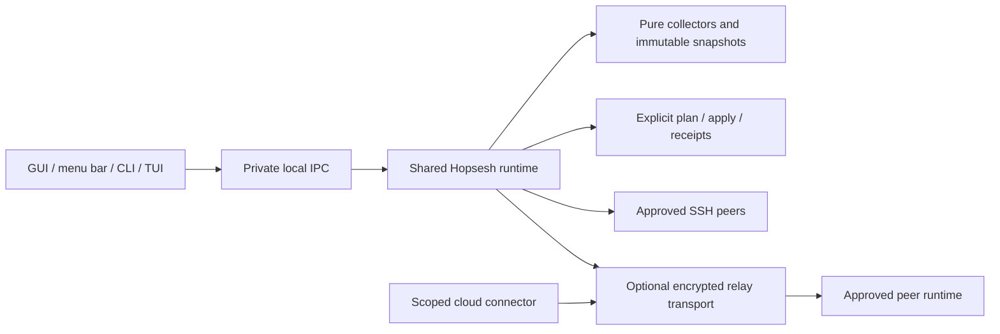

# Hopsesh runtime, cloud connector, and internet relay

Status: approved for 0.5.0; initial research/source snapshot dated 2026-10-07. Implementation and disposable hosted qualification have since progressed in the separate `codex/0.5-runtime-cloud-relay` worktree. Current progress is tracked in [0.5 implementation](0.5-implementation.md), with live evidence in [hosted qualification](relay-hosted-qualification.md). Section 13 records the 2026-10-09 reassessment against `ad5c8b6`. Earlier repository/provider observations below are dated design inputs, not current release or deployment status.

This consolidates the earlier [presence proposal](daemon-presence-proposal.md) with desktop background operation, CLI administration, cloud bootstrap, and internet transport. It revises that proposal's hosting recommendation: use the desktop process when appropriate and the same backend in a headless process when needed. There is one Hopsesh product and one backend implementation.

## 1. Recommended decisions

| Question | Recommendation |
| --- | --- |
| Do desktop users need another installed daemon? | No. Reuse the running desktop app as a runtime host. |
| What about SSH-only machines and internet receiving? | Offer an explicitly enabled headless host in the existing CLI package. No GUI dependencies. |
| Can the CLI discover/install the GUI? | Yes: show installed version, executable actually used, platform support, runtime owner, graphical-session availability, and an explicit installation plan. |
| Can the CLI administer background features? | Yes: one validated settings schema and local IPC, shared with GUI/TUI. |
| How should background work be scheduled? | Consolidate polling, prefer change notifications where practical, and coalesce necessary fallback work to reduce background wakeups. |
| Should receiving require a GUI? | No. Existing SSH on-demand receiving remains available; relay receiving requires an online host. |
| Should cloud sessions get Hopsesh? | Offer opt-in environment integration: verified installation plus per-session startup, enrollment, and capability tests. |
| Does installation imply full native cloud transport? | No. Report observation, export fidelity, import, follow-up, and native resume independently. |
| Internet access without Tailscale/ZeroTier? | An optional Hopsesh relay using outbound HTTPS 443, with application-level end-to-end encryption. |
| Hosting? | A dedicated experimental Worker at `relay.hopsesh.codonic.dev`, separate from the product site and Souvenir services. |
| Initial relay scope? | The user's approved devices and explicitly enrolled cloud sessions. Team sharing follows later. |
| Initial cloud priority? | Claude hosted sessions first; current Codex Cloud as a separately validated connector. Keep legacy Codex capability clearly identified. |
| Remote terminal/control? | Defer a general remote shell. Initial relay methods cover scoped observation and existing planned session transfers. |
| Compatibility/dead code? | Introduce one capability-driven runtime protocol; remove replaced collection/UI paths after parity tests. Do not maintain two competing observers. |

## 2. Current repository facts

Implementation base: freshly fetched `origin/main` at `2635157`, with causal lineage (#65), account profiles (#66), and desktop presence (#67). The separate `release-0.4.0` branch at `91c0029` also includes context-capacity safeguards (#68) and lineage-aware returns/movement notices (#69). PR #70 targets that release branch; its active worktree additionally has appearance settings at `9a27ddd` and an embedded-terminal-family proposal. These are source snapshots, not assertions about the installed or released app; the latest public release is still 0.3.1 at this audit.

- `internal/ui/gui/desktop.go` on main already has a Go background loop and shared Quick access snapshot. It refreshes local discovery around once a minute and presence at 5 seconds foreground / 30 seconds background, suspends while locked/asleep, and skips background work in app-only placement. PR #70 fixes app-only background discovery and default window-close lifetime. Consume that implementation when the release merges to main; do not recreate it in 0.5. Remote/cloud observation is not thereby continuous.
- `cmd/hopsesh-app/main.go` initializes the native app and window. The existing background launch is not a true headless entry point.
- `internal/app/peer.go` runs the receiver CLI on demand over SSH, including a CLI bundled inside `/Applications/hopsesh.app`. `receive` is a separate permission. A closed GUI is not an SSH receiver blocker.
- `internal/app/scan.go` calls `adoptWaiting`, account registration/default selection/login observation, and `applyPending`. A general scan can adopt imported sessions and write movement/account state. The 0.5 observer uses a distinct read-only path: it reads existing endpoint identity, profiles and manifests without registration, binding refresh, native-fork adoption or pending-mark application. It also skips vendor version/login commands and denies module execution/termination. Unknown identity remains uninitialized.
- `agents/codex/cloudtasks.go` uses vendor CLI legacy cloud commands; it explicitly reports that current Codex environments may be invisible to that CLI. Installing a helper is a different integration path.
- `sdk/agent/cloud.go` already distinguishes native, text, code, briefing, and no fidelity. Preserve that distinction in the new capability model.
- `internal/devtools/hsmatrix` has pair/triple covering generation, fake agent/cloud support, and CLI scenario scripts. `internal/e2e/lineage_cloud_test.go` already exercises cloud fork isolation and uncertain-send reconciliation. Extend these assets.
- `.github/workflows/ci.yml` runs Linux/macOS/Windows scenarios and cross-OS pairs. `mesh.yml` additionally uses dumbpipe/iroh public relays for runner connectivity; that is test infrastructure, not the proposed product relay.
- `/Users/tnt/git/codonic/wrangler.jsonc` already describes a Worker with assets, Bridge functionality, and R2 downloads. Use separate deployment resources for Hopsesh. Do not add relay traffic, tokens, or queues to those services.

## 3. Provider research and its implications

### Claude hosted cloud

Official findings: setup filesystem snapshots omit running processes. Repository SessionStart hooks restart on session/resume; multi-repository sessions do not load those repository hooks. Hosted traffic uses an HTTP/HTTPS proxy and domain policy. GitHub release access is limited to attached repositories. API credentials are proxy-injected on Pro/Max, unavailable on Team/Enterprise, and excluded from setup requests. Idle VMs pause and may be reclaimed. [Claude cloud environment documentation](https://code.claude.com/docs/en/cloud-environments).

Hook inputs include session identity and a transcript path. Stop is a turn event; its final-message field can be needed because the transcript may not yet contain the final message. [Claude hooks reference](https://code.claude.com/docs/en/hooks).

Proposal: install from a public, immutable Codonic download host without credentials. Enroll only after runtime starts. Use an idempotent SessionStart bootstrap for supported single-repository sessions and bounded observation hooks for activity. Guard local execution, preserve existing hooks, and treat multi-repository startup as a distinct integration requiring a validated environment-level route or explicit invocation. No green “connected” state until a real challenge response and fresh observation arrive.

Claude's supported local/cloud commands distinguish creating a cloud task, continuing an existing task, and pulling it locally. A helper should complement those vendor paths. [Claude cloud sessions](https://code.claude.com/docs/en/claude-code-on-the-web).

### Current Codex Cloud

Official findings: environments provide an Install script and a Start skill. New tasks use the published filesystem; existing tasks keep their own state. Direct variables are readable by programs; network secrets are proxy-substituted for approved HTTPS destinations on port 443. Host access is configurable, including separate subdomain entries. Tailscale VPN is supported, with both VPN access rules and environment policy applying. [Current Codex Cloud environments](https://learn.chatgpt.com/docs/environments/cloud-environments).

Proposal: install the CLI during preparation; request per-task startup through the Start skill and verify it in a new task and a resumed task. Do not assume an instruction-based Start skill is a deterministic lifecycle callback or that a published helper process survives. A missing start remains “Installed · connector not started.” Prefer proxy-backed enrollment when available; otherwise require limited per-session enrollment. Tailscale remains an optional route for users who already want it.

Codex hook inputs may expose a transcript path, but its format is explicitly unstable. Work Cloud orchestration has different hook restrictions from local Codex execution. [Codex hooks](https://learn.chatgpt.com/docs/hooks).

Proposal: do not copy the Claude hook contract into Codex Cloud or Work Cloud. Qualify each execution surface separately. If stable observation/transcript access is unavailable, expose connector health and code export only, with an explicit reason for unavailable conversation export.

### Legacy Codex Cloud

Official findings: setup scripts and optional maintenance scripts are separate stages; secrets are available only during setup. Agent networking defaults off and can restrict domains and HTTP methods. GET/HEAD/OPTIONS-only settings prevent POST uploads. These documents explicitly concern the legacy experience. [Legacy environments](https://learn.chatgpt.com/docs/environments/cloud-environment), [Legacy internet access](https://learn.chatgpt.com/docs/cloud/internet-access).

Proposal: use its own adapter/capabilities and never advertise legacy CLI support as current-cloud support. Do not preserve a setup secret into a file to defeat the stage boundary. Networking that denies the connector must remain denied and produce an actionable diagnostic.

### Other official routes worth supporting later

- Claude offers self-hosted cloud runners in public beta on Team/Enterprise. Its runner architecture uses outbound connections. This could support a preinstalled Hopsesh connector where customers control compute, but is an additional provider mode. [Claude self-hosted environments](https://code.claude.com/docs/en/self-hosted-environments).
- OpenAI's Agents API offers hosted setup/environment configuration and self-hosted executors. These are API-managed sessions, not an API for arbitrary existing ChatGPT cloud conversations. Treat an API-managed Hopsesh workspace as a separate optional integration with separate credential and billing setup. [Hosted sandboxes](https://developers.openai.com/api/docs/guides/agents-api/environments/openai-hosted), [Self-hosted sandboxes](https://developers.openai.com/api/docs/guides/agents-api/environments/self-hosted).
- Secure MCP Tunnel can expose private MCP services through outbound HTTPS to supported OpenAI surfaces. It could carry scoped Hopsesh tools, but does not replace a provider-neutral device/session transport. [Secure MCP Tunnel](https://developers.openai.com/api/docs/guides/secure-mcp-tunnels).

Unverified requirements: cloud WebSocket upgrades, proxy compatibility of the selected Go HTTP client, connector lifetime while idle, current-cloud hooks, transcript completeness, exact VM/session-ID associations, and native import/control. Documentation supports experiments; it does not prove these capabilities.

## 4. One backend, several hosts



The runtime is a Go library with no Wails/GTK dependency. It provides observation, settings administration, transport sessions, and explicit transfer operations. GUI-only terminal and window services stay with the desktop shell. Observation never silently performs transfer/adoption or vendor lifecycle actions.

Hosting modes:

| Mode | Runtime host | Persistence |
| --- | --- | --- |
| Ordinary CLI | Bounded one-shot core, or attach to an existing host | Ends with command |
| Desktop background | Existing desktop process | Until explicit app quit / OS logout |
| CLI-first persistent | `hopsesh runtime serve --headless` | Foreground supervisor or explicitly registered per-user service |
| Cloud connector | Same collector/transport libraries with a restricted role | Only while the provider environment runs |

One active host per OS user and state namespace; use an OS-held lock and host incarnation, not a PID file. GUI connects to an existing compatible headless host; it does not start a second observer. If the desktop already hosts the runtime, enabling a persistent headless host drains runtime operations and transfers ownership at a safe boundary while preserving GUI-owned terminals. Do not kill an incompatible process or transfer ownership mid-apply. The first implementation must prove this transition or require an explicit safe restart with a clear reason.

IPC uses private Unix sockets plus owner credentials on macOS/Linux, and local named pipes with explicit user ACLs and rejection of remote clients on Windows. Namespace/protocol mismatch produces a diagnostic, not a silent fallback to the default user's data. Remote methods cannot select arbitrary profile roots.

### Background behavior

- “Keep running when the window closes” hides the window and retains the chosen runtime host.
- “Start at login” reports actual OS registration independently of receiving/sharing permissions.
- “Run without a desktop session” is an explicit headless option. Installing the GUI alone does not enable it.
- Full desktop quit uses existing terminal-aware handling. Stopping an observer cannot terminate vendor agents or unrelated shells.
- Persistent headless stop reports active transfer operations, drains safely, and stops only owned helpers. Interrupted commits reconcile by operation ID.
- Sleep invalidates leases. Wake, reconnect, and OS clock changes trigger fresh observation before claiming current activity.
- SSH receiving stays on demand. Relay receiving is available only while a permitted receiver runtime is online; offline delivery can stage encrypted data, never claim it was applied.
- Login-only OS registration is not pre-login availability. Validate macOS, Windows, Linux user-service/logout behavior separately. Linux lingering, system services, and stored task credentials require an explicit deployment mode rather than silent installation defaults.

## 5. CLI discovery, installation, and administration

Proposed commands:

```text
hopsesh app status --json
hopsesh app install --plan
hopsesh app install --version <version>
hopsesh app open
hopsesh runtime status --json
hopsesh runtime start --headless
hopsesh runtime enable --at-login
hopsesh runtime disable
hopsesh runtime stop
hopsesh settings get <key> --json
hopsesh settings set <key> <value>
hopsesh doctor --scope runtime|cloud|relay --json
hopsesh relay pair
hopsesh relay status
hopsesh relay revoke <device-id>
hopsesh cloud integration plan <provider>
hopsesh cloud integration test <provider>
```

Discovery is read-only and does not launch the GUI. Return installed/not-installed/unsupported, bundle path, version, executable selected by PATH, bundled CLI version, signature/package verification, running host, service state, and whether a graphical session can display a window. Account/login availability remains a separate field. A CLI-only headless Linux installation must not link GTK just to answer these queries.

Installation resolves an explicit OS/architecture package and user-writable destination. Verify a signed release manifest and digest before execution/extraction; validate platform signing where available. A checksum fetched from the same compromised server without an independently trusted signature is insufficient. Check version compatibility, available disk space, package contents, and rollback before switching. Preserve running executables and active sessions; defer incompatible runtime upgrades until operations drain. Show an actual permission error or elevation requirement where a system destination is selected.

If PATH and bundle contain different CLIs, report which executable is used and offer an explicit resolution. Never overwrite an unrelated PATH entry. Remote installation runs only through an already authorized administration connection and the same reviewable plan; scanning a peer must not install software.

Shared schema families: `runtime`, `observation`, `receive`, `sharing`, `peers`, `relay`, and cloud integration policy. GUI-only appearance/window keys are tagged accordingly. Backend values are validated identically across all clients. Compare-and-swap config revision prevents lost updates; runtime-only values are not mistakenly persisted. Secrets accept protected input and return references/redacted values, never plaintext in JSON or diagnostics. Cloud connector settings cannot enable a general receiver, widen its root, or grant administrative rights.

## 6. Observation and understandable state

Extract a pure collector from the existing scan/adoption pipeline. Its allowed writes are its own private cache and diagnostics. Tests must detect mutations to native sessions, agent databases/configuration, movement journals, account binding, and lineage. Watchers accelerate collection; bounded periodic reconciliation recovers missed filesystem events.

Identity must preserve endpoint/OS user, runtime profile, auth binding and epoch, agent, native session, lineage branch/replica, and runtime incarnation. Machine/profile labels, titles, repository paths, and cloud-provided ID strings are not proof of equality or account ownership. PID reuse needs process-start identity. A cloud session has a stable approved logical identity plus new runtime incarnations on rebuild; two sessions from the same cached environment remain separate endpoints.

Every snapshot carries source, coverage, generation/sequence, observed age, confidence, and typed error. Distinguish:

| Dimension | Example |
| --- | --- |
| Connectivity | Online / unreachable / retrying / revoked |
| Runtime | Installed / starting / running / stopped / incompatible |
| Observation freshness | Checked 8 seconds ago / stale / never checked |
| Agent presence | Open / closed with complete evidence / unknown |
| Agent activity | Working / waiting for approval / last observed working / unknown |
| Transfer | Queued / staging / review required / applying / applied / result uncertain |
| Capability | Conversation export available / code only / not supported |

A heartbeat proves connector reachability, not current agent activity. An empty partial scan cannot prove sessions ended. A vanished cloud connection does not prove the task finished or VM expired. Provider-reported pause/expiry can be displayed only with that evidence; otherwise show “Cloud connector offline · last checked …”.

Proposed fallback intervals, to benchmark: local presence 5 seconds viewed / 30 seconds background; inventory reconciliation 60 seconds where needed; selected direct peers 15 seconds viewed / 60 seconds background; at most two concurrent peer connects; network deadline 5 seconds for a probe; jittered backoff 5 seconds to 5 minutes. These are fallback starting points, not mandatory permanent polling loops. A healthy supported event stream should permit slower reconciliation; a source without notifications retains bounded polling. Relay connection lease 90 seconds with up to a 30-second heartbeat, piggybacked on other authenticated traffic where possible. Freshness belongs to each data source, independently of transport. Reconnection uses a nonce challenge and bounded source age; never trust an arbitrary wall-clock timestamp to renew freshness. Sequence gaps force a full bounded resnapshot. Negative absence requires complete coverage.

### Energy efficiency and change notifications

Recommendation: **consolidate polling and prefer change notifications where practical, to reduce background wakeups**. Apple's guidance recommends replacing timers with suitable event notifications, canceling unnecessary timers, and allowing timer tolerance so work can be batched. [Apple energy guidance: minimize timer usage](https://developer.apple.com/library/archive/documentation/Performance/Conceptual/power_efficiency_guidelines_osx/Timers.html).

- Use one runtime scheduler for collection, peer reconciliation, retry, and leases. GUI, menu bar, CLI, and TUI subscribe to its snapshots; they do not each poll agents or start a separate scan timer. Visible relative-time labels may update locally without collecting again.
- Prefer supported vendor subscriptions, explicit owned-terminal lifecycle events, opt-in agent hooks, filesystem notifications, and OS network/sleep/wake events. Validate each vendor subscription's side effects before treating it as observation. On macOS, evaluate dispatch sources/FSEvents for appropriate files/trees; use equivalent supported Windows/Linux watchers with the same fallback contract.
- Share watchers per configured profile/root. Debounce a burst into one bounded collection; an initial proposed 250 ms quiet period and 2-second maximum batch delay need testing. A continuous writer must not postpone updates indefinitely. A watched root replacement, directory rename, overflow, dropped event, or sequence gap schedules reconciliation.
- Use the next required deadline rather than a permanent high-frequency ticker for all background clients. Cancel work with no enabled purpose/subscriber; an explicitly enabled receiver remains an enabled purpose. Allow platform timer leeway for noncritical background work. Security/grant expiry and stale-state checks use actual monotonic age, never an assumed precise timer firing.
- Stream changed observations over approved subscriptions/relay where feasible. For SSH sources without a stream, consolidate one in-flight probe and back off while unchanged or unreachable. For HTTP-only cloud connections, use bounded long polling or adaptive polling according to measured proxy behavior. Account for server cost too: a hanging Durable Object request prevents hibernation, so long polling is not automatically the cheapest transport.
- Piggyback liveness on real traffic and share reconnect work. Transport pings keep a connection alive but cannot refresh an old agent observation. Do not export full transcripts periodically merely to refresh a status badge.
- Suspend unnecessary observation during sleep and when its privacy policy requires it on lock, then reconcile on wake. Do not treat a missed timer as a closed session or increase cloud activity to evade provider suspension.

Measure idle timer firings, source probes, watcher count, scan count, wakeups, CPU time, and energy impact with zero/one/multiple clients. Native macOS acceptance should use Instruments energy profiling or another appropriate platform measurement, alongside functional tests. Report before/after results for the same workload; a lower CPU percentage alone does not prove fewer wakeups.

UI/TUI use the same state model. Each machine row has Scan with an active disabled state, progress, last success, current failure reason, and next retry. Cloud cards show environment integration separately from individual connected sessions. Filters/grouping retain Local, Other machines, and Cloud without relabeling local replicas as cloud. Session details show all observed active copies, lineage branch, move/return counts, and fidelity. Status is text/icon as well as color. Commands name their result: “Install desktop app,” “Enable background receiver,” “Reconnect cloud connector,” “Bring conversation and code,” or “Bring code only.”

Diagnostics provide a redacted JSON bundle with runtime/version/namespace, recent source failures, transport selection, capability-test results, operation IDs, and timing. No default transcripts, titles, paths, emails, environment values, credential headers, or pairing codes. Local logs use bounded rotation; relay logs contain opaque identifiers, counters, error categories, and correlation IDs.

## 7. Relay architecture and protocol

Internet mode is opt-in. Existing direct SSH remains preferred when explicitly configured and usable; relay is selected only for approved peers. A timeout does not silently add a peer, grant receive permission, or join cloud infrastructure.

Both ends make outbound connections to `relay.hopsesh.codonic.dev:443`. Start with authenticated POST message submission and bounded GET polling; optionally negotiate WebSockets after a capability probe. Respect `HTTPS_PROXY`, proxy credentials and custom trust roots without printing them; certificate failures are errors, never a reason to disable verification. Do not use query strings or GET bodies to smuggle writes around a provider's HTTP-method policy.

Proposed endpoint groups:

| Group | Methods and purpose |
| --- | --- |
| `/v1/capabilities` | GET public protocol/limits; no private inventory |
| `/v1/enrollment/*` | POST authorization and restricted credential exchange |
| `/v1/messages` | POST bounded encrypted envelopes |
| `/v1/messages?cursor=…` | GET bounded encrypted delivery batches |
| `/v1/ack` | POST acknowledged delivery cursor; independent of apply result |
| `/v1/connect` | Optional authenticated WebSocket upgrade |
| `/v1/blobs/*` | POST bounded encrypted chunks; GET authenticated retrieval |

GET never creates jobs or changes sessions. Optional HEAD/OPTIONS support is not permission to mutate. Require POST on the relay host for a functioning connector; explain when provider policy denies it. WebSocket support and HTTPS credentials must be tested separately; the HTTP fallback is a real protocol, not an untested emergency path.

Use a dedicated Worker for authentication, strict frame validation, quotas, and routing; a SQLite-backed Durable Object per authorization space for connection/mailbox coordination; and a separate private R2 bucket for bounded ciphertext transfer chunks. Avoid one global object. Use Durable Object storage for ordering/revocation and recovery, not Workers KV for correctness-critical locks or operation state. Native transfer receipts remain endpoint-owned.

Cloudflare's server-side WebSocket Hibernation keeps inbound clients connected while idle and resets object memory on reactivation. Proposal: restore connection attachments and durable cursor state; avoid per-connection server timers/outbound sockets that defeat hibernation. [WebSocket Hibernation](https://developers.cloudflare.com/durable-objects/best-practices/websockets/), [Object lifecycle](https://developers.cloudflare.com/durable-objects/concepts/durable-object-lifecycle/).

Custom domains can point a dedicated Worker at a subdomain. [Worker custom domains](https://developers.cloudflare.com/workers/configuration/routing/custom-domains/). Proposed companion host: `downloads.hopsesh.codonic.dev`, serving immutable CLI packages and signed manifests without redirects to third-party hosts or private authentication. Neither hostname is provisioned by this design.

### Authentication, encryption, and permission boundaries

Device enrollment associates a generated key with the user's authorization space. Prefer a standard device authorization flow for CLI login, including expiry, polling limits, denial, and revocation. Account login authorizes enrollment; it does not itself validate another endpoint's public key. [OAuth device grant](https://www.rfc-editor.org/rfc/rfc8628).

Authenticate peer keys using an approved-device signature chain or explicit QR/fingerprint comparison through a trusted channel. Use a reviewed implementation of an established authenticated protocol, such as Noise, with fresh connection keys, domain separation, transcript binding, replay protection, and explicit limits. Choose and pin the exact implementation/suite during implementation review. Do not invent cryptography. Offline encrypted bundles need their own reviewed recipient-encryption construction; Noise's online channel is not automatically an offline storage protocol. [Noise specification](https://noiseprotocol.org/noise.html).

The relay sees routing identifiers, IP addresses, timing, sizes, and quotas. It should not receive plaintext observations, titles, transcripts, code, account credentials, or device private keys. End-to-end confidentiality requires authenticated endpoint keys; encryption without authenticated key exchange still permits server substitution. Compromised authorized endpoints can read their authorized data. Agent code in a cloud VM shares that VM's trust boundary, so its credential must be narrow even when protected by a provider proxy.

Separate grants: `observe`, `export-conversation`, `export-code`, `receive-session`, and `admin-device`. Launch/follow-up/stop controls require their own vendor-supported capability and grant; none is implied by observation or relay enrollment. A cloud connector initially gets observation and user-enabled export only, scoped to one session/workspace. No arbitrary shell, arbitrary-path reader, recursive network proxy, OS administration, or unrestricted write endpoint.

Plans bind destination endpoint/profile/auth epoch, branch/replica, workspace policy, content hash, permissions, capability version, operation ID, and expiry. The receiver enforces these independently of the relay. Relay-side revocation immediately removes routes; endpoints reject expired grants and refresh authorization before apply. Define a maximum offline authorization lease and show pending revocation where an endpoint cannot be contacted. Previously downloaded data cannot be remotely erased by revocation.

### Delivery and transfer recovery

Queue transport envelopes at least once. Apply deduplication and effect journaling at the receiver; do not promise an exactly-once network. Separate “relay accepted,” “receiver staged,” and “receiver applied.” An authenticated apply receipt reconciles a lost response. Never retry an uncertain vendor-side creation automatically.

All transport paths call the existing plan/apply/undo core. Relay is a transport adapter, not a second lineage/import implementation. Transfer envelopes use fixed methods and bounded binary attachments; they cannot contain shell commands. Validate chunk hashes, final manifest, decompression sizes, path containment, symlinks, and filenames. Stage in private storage; commit only after validation and current destination preconditions. A route change from SSH to relay keeps the operation ID and receipt identity.

Proposed alpha bounds: 256 KiB control envelopes, 1 MiB encrypted chunks, 100 MiB per transfer, 1 GiB staged quota per authorization space, bounded pagination, and explicit queue-full errors. These intentionally remain below platform maximums; tune only with benchmarks. [Durable Object platform limits](https://developers.cloudflare.com/durable-objects/platform/limits/).

Offline ciphertext expires logically after 24 hours. Enforce expiry in the application on every read, deny retrieval after expiry, delete on delivery/cancel where possible, and use scheduled cleanup plus R2 lifecycle as a backstop. R2 lifecycle removal can lag the expiration time; do not promise immediate physical deletion at TTL. [R2 lifecycle behavior](https://developers.cloudflare.com/r2/buckets/object-lifecycles/).

### Alternatives and operating cost

Tailscale direct/DERP remains a useful user-managed option; its relayed traffic is end-to-end encrypted. Hopsesh's product relay borrows that encrypted-forwarder principle without requiring tailnet membership. [Tailscale connection types](https://tailscale.com/docs/reference/connection-types).

Cloudflare Tunnel offers outbound origin connectivity, but by itself does not provide Hopsesh peer enrollment, encrypted mailboxes, native receipts, and per-session grants. Use it for infrastructure only if needed. [Cloudflare Tunnel](https://developers.cloudflare.com/cloudflare-one/networks/connectors/cloudflare-tunnel/).

Measure Worker invocations/CPU, Durable Object duration/messages/storage, R2 bytes/operations, polling share, and per-user traffic. Hibernation and batching matter. An illustrative 100 always-online clients each issuing one POST and one GET every 30 seconds generate 17.28 million HTTP requests in 30 days, before transfers/retries. This is workload arithmetic, not a cost quote. Budget for paid infrastructure and set an alpha spending/traffic ceiling; do not advertise the relay as free to operate. [Durable Object pricing](https://developers.cloudflare.com/durable-objects/platform/pricing/), [Worker pricing](https://developers.cloudflare.com/workers/platform/pricing/), [R2 pricing](https://developers.cloudflare.com/r2/pricing/).

## 8. Cloud bootstrap and integration levels

The integration wizard produces reviewable files/instructions rather than silently editing provider settings. It reports download and relay hosts, required HTTP methods, expected provider stages, required repository hooks/skills, exported data scope, and credential mechanism. Installation and sharing/receiving are distinct toggles.

1. **Prepare environment:** download the pinned Linux CLI for the detected architecture; verify its signed manifest/digest; install executable and non-secret bootstrap config only. Preserve existing scripts/settings. Never bake enrolled keys, one-use tickets, received sessions, or logs into the cached/published image.
2. **Start runtime:** a validated per-session mechanism executes a fast, bounded, idempotent bootstrap. Start one connector per native session/runtime identity. A startup hook returns promptly without blocking the vendor session indefinitely or injecting relay messages as agent instructions. Provider lifetime controls still apply; no keepalive intended to evade idle suspension.
3. **Enroll:** generate a new runtime key after the prepared-image stage. Exchange a proxy-backed, environment-scoped enrollment credential where supported; it permits provisional registration only. In Claude this exchange occurs after setup because setup credential injection is excluded. Otherwise use an expiring one-use ticket issued for the intended session by Hopsesh. Personal machine refresh tokens/private keys never go into the VM.
4. **Approve identity:** a provider/session ID reported by the connector is self-reported. Bind it to a Hopsesh-issued handoff ticket or a trusted provider check if one exists; otherwise require visible pairing approval before joining lineage or exposing data. Shared environment credentials do not identify the human who started a task. Environment IDs are not authorization-space IDs.
5. **Advertise capabilities:** register only what a challenge/test has established, including runtime startup, fresh activity evidence, conversation export format/completeness, code export, receive/import, follow-up, and native resume. Failed integration preserves normal vendor work.
6. **Reconnect/resume:** use persisted session-specific proof where safe and available, or a new enrollment/approval. A rebuilt VM increments incarnation. Cached-image clones must never inherit an approved leaf credential. Unknown association produces a new provisional endpoint, not automatic adoption of another task.
7. **Stop/expiry:** send a best-effort final checkpoint and revoke the lease. Retry failed exports within the live VM's bounds. A lease timeout changes reachability only. Durable user-approved exports survive VM reclamation according to the user's retention settings.

| Integration level | User-visible benefit | Evidence needed |
| --- | --- | --- |
| Installed | Helper ready in environment | Verified executable |
| Connected | Cloud endpoint reachable | Authenticated lease/challenge |
| Observed | Working / waiting / current session | Fresh supported event source |
| Exportable | Bring verified conversation/code snapshot | Tested adapter, completeness, hashes |
| Controllable | Explicit vendor-supported follow-up/resume | Provider control capability plus user grant |

Cloud export uses the allowed transcript/event source and a sealed checkpoint; never races a partially written tail or calls a full-history upload complete when final records are missing. Record fidelity, segment boundaries, compaction provenance, and omissions. Code export is optional and needs its own selected files/diff policy; do not include `.env`, credentials, or arbitrary untracked files by default. Binary/ignored data policies must be visible in the transfer preview.

For a cloud destination unable to import native history, return a briefing or supported representation and say so. Installing Hopsesh does not manufacture a vendor native-import API. Retain encrypted archived material separately if requested; keep resumed model context within the destination capacity and disclose summaries/omissions. No automatic model turn just to generate a summary or test connector presence.

## 9. Lineage, returns, and forks across transports

Use the existing branch/replica/causal receipt graph. Transport connection IDs and VM incarnations are observation metadata, not new moves. Only confirmed transfer effects advance journey counts. A retry, reinstall, reconnect, or duplicate export does not add a hop.

Mandatory routes, each with real appended turns between hops:

- A Claude → B Claude → A Claude → B Claude → A Claude.
- C Claude → C Codex → C Claude, with unchanged endpoint and explicit agent/profile boundaries.
- A Claude → B Codex → A Claude.
- A Claude → B Codex → C Claude → A Claude.
- A → B → C → B → C → A → B, mixing SSH, relay, and cloud endpoints.
- A → Claude cloud → B Codex → A Claude, including cloud suspend/rebuild.
- A → current Codex cloud → B Claude → A, using the actually available export fidelity.
- Fork before departure; fork while on B; fork in cloud; then move parent and child independently and return both.

Assert hop order, explicit predecessor IDs, branch-local counts, correct prior destination/profile, stable native append where supported, no duplicated prefix, no sibling contamination, and preservation of approved account boundaries. Two concurrently advanced replicas require an explicit destination/branch choice; presence does not choose a winner or overwrite the other. Conflicting code remains in the existing review/conflict flow. A cloud self-claim cannot create a return target or replace a signed receipt.

Display completed returns and total transfers using the existing journey semantics, which implementation must inspect before adding expectations. Machine names alone must not redefine the meaning of “return”; labels can change and several profiles/agents can live on one machine. The new feature extends the graph and transport coverage, not a competing counter algorithm.

## 10. Test plan and scenario matrices

All cases below are acceptance requirements to implement. None was executed for this design. Keep deterministic fixtures as the required PR gate; live provider tests are separate, explicitly enabled qualification checks, never replaced by a fake-provider pass.

### Matrix factors

Extend `hsmatrix` with valid constrained factors for runtime host (one-shot/desktop/headless/cloud), transport (SSH/relay HTTPS/relay WebSocket), provider generation, integration level, network policy, account scope, branch topology, and failure point. Pairwise generation alone cannot cover ordered multi-hop behavior: add named sequences explicitly, use triples nightly/release, and verify coverage metadata. Keep invalid combinations visible as unsupported capability results, not silently skipped success.

| Family | Required cases | Expected invariant |
| --- | --- | --- |
| CLI install | Missing app; bundle only; CLI only; mismatched PATH; unsupported OS/arch; corrupt download; invalid signature; insufficient space; rollback | Truthful detection, verified install, no unintended launch/session loss |
| CLI settings | GUI running/closed; no display; same revision writers; malformed value; sensitive input; unavailable setting | Shared validation, no lost updates or secret output |
| Host ownership | Simultaneous GUI/CLI starts; two namespaces/users; PID reuse; stale socket; wrong owner; incompatible host; busy transition | One owner per namespace; no kill/unlink of unrelated processes |
| OS lifecycle | Window close/quit; login enabled/disabled; service start/stop; logout; reboot; lock/unlock; sleep/wake; tray disappears | Actual state, owned-process cleanup, no fabricated pre-login availability |
| Pure observation | Repeated scans; pending adoption; malformed vendor data; account change; vendor metadata repair; file event loss | Native data/journals/config/lineage unchanged |
| Freshness | Missing source; partial page two; timeout; late reply; clock skew; event gaps; transport alive/source stalled | Unknown/stale preserved; negative state requires complete evidence |
| Notifications/energy | No clients; one/multiple UI clients; burst edits; continuous writes; watcher overflow; root replacement; unavailable events; sleep/wake; HTTP fallback | Shared watchers/scheduler, bounded updates, recovery without duplicate scans, measured idle wakeup reduction |
| Scope isolation | Duplicate labels/native IDs; different OS users/profiles; login rebinding; unknown binding; cloud shared environment | No identity or account collision |
| Relay enrollment | Expired/used ticket; denied device auth; polling slowdown; key substitution; forged approval; copied VM credential | Deny unapproved identity/authority |
| Relay network | Both behind NAT; IPv4/IPv6; UDP blocked; HTTPS proxy; custom CA; bad TLS; GET-only; host denied; WS blocked | HTTPS works where allowed; policy denial explained; no bypass |
| Relay recovery | Lost ACK; duplicated/reordered frames; reconnect; hibernation; Worker redeploy; cursor gap; full queue; revoked peer | No duplicate apply/hop; bounded recovery and current permission check |
| Payload safety | Oversized frame; bad hash; truncated chunk; zip bomb; traversal; symlink escape; bad Unicode path | Reject before mutation; bounded CPU/memory/disk |
| Offline transfer | Receiver offline; TTL expires; cancellation; partial upload; sender disappears; keys revoked | Queued is distinct from applied; expired data inaccessible |
| Apply failures | Crash before/after staging/commit/receipt; lost vendor response; alternate transport retry | Reconcile effect; never blindly create a second vendor session |
| Claude bootstrap | Cold/cached setup; single/multi-repo; startup/resume/compact; missing binary; local hook; setup credential absent; wrong release host | No cached identities; bounded hooks; clear unsupported route |
| Codex bootstrap | Current Install/Start skill; fresh/published/resumed task; Start skill omitted; legacy maintenance; secrets removed; Work Cloud | Correct surface capabilities, no assumed hook equivalence |
| Cloud permissions | Observe only; transcript opt-in; code opt-in; receive/control denied; repo mismatch; shared enrollment credential | Minimum session authority; no machine admin |
| Cloud data | Partial final record; Stop precedes file flush; transcript unavailable/changed; compaction; huge history; unknown session alias | Honest completeness/fidelity and bounded resumed context |
| Cloud lifetime | Pause, rebuild, cached clone, missed final checkpoint, environment update while task lives | Incarnations separated; offline does not mean completed |
| Lineage | All section 9 routes, same-machine cross-agent, repeated returns, parent/child simultaneous movement | Causal graph and branch isolation across transport |
| GUI/TUI | Per-row scan states; remote/cloud grouping; hidden unsupported actions; keyboard navigation; stale badges; revoke errors | Same state semantics across surfaces |
| Operations | Malformed clients; rate limits; auth-space isolation; outage; quota/billing ceiling; privacy exports; retention cleanup | Bounded load, useful redacted errors, local/SSH remains usable |

### Required execution layers

1. Pure Go tests with fake clocks, fake vendor files/events, fault injection, replay fixtures, and `-race` on Linux/macOS/Windows. Include an independent reference model for graph/effect invariants and seeded property tests; retain failing seeds.
2. CLI `.txtar` scenarios for status/install plans/settings/doctor/cloud integration, with no installed GUI or network credentials required.
3. Existing OS-pair matrix: run approved transfer routes over SSH and an embedded deterministic relay. Add all six directed cross-OS pairs and critical three-endpoint routes, with fake cloud endpoints as additional nodes.
4. Relay Worker tests using Cloudflare's test runtime: actual authentication/routing/storage/hibernation handlers, not a standalone Go fake only. Exercise expiry, cursor restoration, tenant isolation, disconnects, and storage errors. [Cloudflare test APIs](https://developers.cloudflare.com/workers/testing/vitest-integration/test-apis/).
5. Cross-language contract fixtures shared by Go clients and the Worker: frame parsing, hash checks, capability negotiation, grant validation, limits, and error classification. Golden wire fixtures must include rejected malicious input.
6. Browser tests in the existing Chromium/WebKit suite, plus native lifecycle/install tests for each supported OS. Headless Linux tests unset display variables and run a CLI binary with no GTK dependency.
7. Isolated staging relay across real runners: separate test authorization spaces, short-lived CI credentials via narrowly scoped federation where supported, and automatic cleanup. Untrusted PR jobs receive no production/staging secrets; run their relay locally. Existing public mesh remains a separate best-effort network lane.
8. Real provider qualification: cold/cached/resumed Claude sessions, current Codex environments, legacy capability where still supported, and actual HTTP/WS policy tests. Capture provider/CLI versions, environment generation, measured fidelity, and scrubbed artifacts. Live gates should state supported/failed/unavailable distinctly. Do not put personal subscription credentials into hosted CI.
9. Resource/load tests: 100 logical devices, many profiles, stalled peers, burst exports, long offline queues, hibernation wakeups, and repeated reconnects. Measure timer/wakeup and probe counts with zero/one/multiple subscribers, notifications on/off, and HTTP/WebSocket transport. Additional UI clients must not multiply underlying collectors, watchers, or idle source polling. Test event loss and fallback interval bounds. Proposed idle targets: under 1% of one core and under 50 MiB incremental runtime memory for three profiles/three peers; measure against desktop baseline rather than treating targets as results. Define a wakeup budget from measured native baselines before release.

Release gates: required deterministic tests pass; no source side effects or cross-user leaks; safe failure/recovery paths pass; advertised provider capabilities pass live qualification; native close/login/headless behavior is exercised; relay usage/retention controls are measured. Passing a fake matrix alone cannot qualify a provider integration.

## 11. Implementation stages and cleanup

| Stage | Deliverable | Exit condition |
| --- | --- | --- |
| 0 | Disposable provider capability experiments and saved research fixtures | Startup, proxy POST/GET, transcript source, identity binding, and lifetime evidence; unsupported capabilities recorded |
| 1 | Pure collector, shared immutable snapshots, consolidated scheduler/change notifications, scoped identity and diagnostics | Observation side-effect, freshness, event-loss and idle-wakeup tests; current desktop UX preserved |
| 2 | CLI app discovery/install plan, common settings API, headless entry point, IPC ownership | CLI-first/no-display acceptance and OS lifecycle tests |
| 3 | Embedded relay transport and receiver authorization integrated with existing movement core | Complete replay/crash/lineage/contract tests across OS pairs |
| 4 | Separate experimental hosted relay/download service, device enrollment, quotas, retention | Isolated staging qualification, operator metrics, privacy and spend limits |
| 5 | Claude environment wizard and restricted cloud connector; then current Codex integration | Real cold/cache/resume tests and declared fidelity/capabilities |
| 6 | Unified GUI/TUI status, related active copies, lineage, remote/cloud filters and diagnostics | Native/browser acceptance; all section 9 journeys pass |

Merge freshly fetched main as the 0.4 release work lands, preserving the other session's changes. Do not replace concurrently changed account/lineage/instruction/terminal code from the older checkout. Retain 0.4's capacity safeguards and causal movement notices in every new transport. Terminal ownership must be observed dynamically: Claude `/branch` can change the active native session within the same process/tab, so launch-time association alone is insufficient.

Retire the desktop-only duplicate scheduler once it consumes the runtime; remove observer calls to adoption/cleanup; remove dead installer/platform branches, hardcoded current-vs-legacy cloud assumptions, duplicate scan-state UI, and untested relay methods. Keep intentional one-shot and direct-SSH modes as supported hosts/transports using the same core. Legacy vendor support is a capability with an eventual removal date, not a second runtime compatibility system.

Do not add an always-installed privileged service, automatic peer software installation, a generic internet shell, automatic fork merging, false native-cloud promises, or full transcript synchronization merely to show presence. Any later expansion should declare its capability and extend the same tests and authorization model.

## 12. Decisions still needing evidence

- Exact runtime process transfer under an already-open GUI, while GUI-owned terminals remain alive.
- Which cloud surfaces execute guaranteed startup callbacks versus best-effort Start skill instructions.
- Whether each provider proxy permits the chosen HTTP client, credential exchange, and optional WebSocket upgrade.
- Which vendor IDs/events or user pairing steps can securely bind a helper to a known session; self-report is insufficient.
- Actual transcript availability/completeness and supported native import/follow-up surfaces for each provider generation.
- Per-platform unattended service behavior after logout/before login and access to protected key storage.
- Reviewed online/offline encryption implementations, sustainable relay quotas, and measured cost/performance.

These are qualification work items, not reasons to hold back the independently useful CLI administration and pure observation stages. Recommended initial product promise: “Manage Hopsesh from the CLI, keep it available in the background, see fresh state on approved endpoints, and move supported sessions over SSH or the internet with clear fidelity and lineage.”

## 13. Qualification failures: research reassessment, 2026-10-09

This review compares current primary documentation with source at `ad5c8b6` and
the recorded disposable tests. Documentation, implemented behavior and live
qualification are separate evidence. Recommendations below do not change provider
permissions or turn unfinished capabilities into passed release gates.

### Claude authorization

Documented: protected `.claude` writes receive an additional check even when an
allow rule matches. Cloud's **Accept edits** label corresponds to Manual/default
behavior, not bypass mode. The docs describe a Recently denied manual retry UI,
but our browser exposed only the mode selector; availability must be verified
on the actual hosted surface. [Permission modes](https://code.claude.com/docs/en/permission-modes).

The current classifier configuration reference offers `claude auto-mode config`
and `claude auto-mode defaults --label …` for diagnosis. It excludes project/local
settings from `autoMode`, distinguishes hard and soft denials, and says
`/auto-mode-setup` is unavailable in cloud. `autoMode` is different from the
`permissions.allow` command rules attempted in qualification. Inspect the installed
version rather than assuming every current documented feature exists there.
[Auto mode configuration](https://code.claude.com/docs/en/auto-mode-config).

Observed: Claude 2.1.295 refused disposable export as Data Exfiltration and the
temporary permission-file write as Self-Modification. No temporary rules or
export completed. The subsequently reviewed command output shows the effective
configuration equals the installed shipped defaults in all four sections:
Data Exfiltration is the hard-deny rule, Self-Modification is a soft-deny rule,
and the relay/download domains are absent from the environment list. This
establishes the effective tiers; it does not reveal the classifier's internal
reasoning for the permission-file refusal. See the
[qualification record](relay-hosted-qualification.md#actual-startup-and-scoped-connector-tests).

Recommendation: retain only relevant effective-rule/denial details, with secrets
and unrelated infrastructure redacted; this diagnostic is now complete. Prefer a
provider-supported exact-action manual retry. If absent, prepare a concrete user-operated manual-approval flow in
the actual cloud UI; a mode change is distinct from the approved command rule,
and must not be silently substituted. Restore the prior mode afterward. Do not
ask the model repeatedly to rewrite its own authorization. Do not substitute a
setup script, hook, encoding or alternate shell to execute the denied action.
If supported approval still fails, retain the capability restriction and a
minimal synthetic reproduction for an explicitly authorized vendor report.

For reusable onboarding, review public bootstrap files before starting the cloud
task. Keep provisioning separate from session consent; never commit admissions,
private keys, routing tokens or standing transcript-export permission. This is
an architectural recommendation, not another route for the refused export.

### Real provider lifecycle and diagnostic evidence

Claude documents cached filesystem provisioning, not surviving setup processes.
Idle VMs pause automatically and may later be reclaimed. Background Bash commands
also have a finite lifetime: credential lifetime does not guarantee process
availability. [Cloud environments](https://code.claude.com/docs/en/cloud-environments).
Its hook contract distinguishes startup, resume, clear, compact and fork.
Compaction does not establish VM rebuild. [Hooks](https://code.claude.com/docs/en/hooks#sessionstart).

Source finding: `ReadSessionStart` validates `source`, but
`internal/ui/cli/cloudintegration.go` discards it before saving an incarnation.
`Begin` rotates keys for every invocation, including compact. Preserve this
conservative authorization behavior, but retain the validated event reason and
timestamp as private diagnostic metadata, separate from permission scope.
Explicit CLI preparation must be identified as manual. Metadata must never
prove a provider event by itself or grant access.

Revised experiment: publish a reviewed environment, start a fresh task, record
callback/process/identity evidence, leave it idle without synthetic keepalive
traffic, then continue through the provider UI. Correlate the callback with
provider resume evidence. Test reclaim/rebuild only when it actually happens;
without a deterministic provider trigger, keep that row unqualified. Helper
restart and `/compact` cannot pass it. Expired observations should show stale or
disconnected, not imply that the provider task has ended.

Current Codex uses a published environment's Install script and Start skill;
existing tasks retain their state. Test changed networking in a new task. Its
lifecycle differs from Legacy setup/maintenance scripts.
[Current environments](https://learn.chatgpt.com/docs/environments/cloud-environments),
[Legacy environments](https://learn.chatgpt.com/docs/environments/cloud-environment).
Generic Codex hook documentation includes session identity and a nullable
transcript path, explicitly warns that transcript format is not stable, and
documents separate Work Cloud restrictions. This does not prove that command
hooks run in the current hosted environment under test.
[Codex hooks](https://learn.chatgpt.com/docs/hooks).

Recommendation: qualify the Start skill in a newly published task; preserve an
explicit unsupported result when native binding is unavailable. Observed ID
environment variables are test evidence, not a documented identity API. Keep
current Codex observation-only until an independently verified binding and
supported transcript source pass. Do not derive identity from a scratch path
or scan unrelated native transcripts.

### Windows supervisor timeout

Children inherit the parent environment unless the caller supplies a replacement.
PowerShell `-NoProfile -NonInteractive` avoids profile loading and interactive
prompts. Task Scheduler `InteractiveToken` requires an existing interactive
login; it is not a pre-login service.
[Process environment](https://learn.microsoft.com/en-us/windows/win32/procthread/environment-variables),
[PowerShell arguments](https://learn.microsoft.com/en-us/powershell/module/microsoft.powershell.core/about/about_powershell_exe?view=powershell-5.1),
[Task logon types](https://learn.microsoft.com/en-us/windows/win32/taskschd/taskschedulerschema-logontype-simpletype).

Observed: direct native COM querying passed, while isolated CLI enable timed
out. `ad5c8b6` preserves selected Windows infrastructure/profile variables and
keeps Hopsesh/agent state isolated. This is a plausible fixture repair, not yet
a proven root cause. Production already uses those PowerShell flags and a
bounded query deadline.

Recommendation: compare direct COM and actual CLI with the same environment.
If failure persists, capture separate timings for process launch, COM creation,
Connect, GetFolder and GetTask. Log phase/error code, not task XML or environment
values. Denied access and timeout must remain unknown rather than absent.
Verify registration and runnable login context separately. Do not repeatedly
increase timeouts or introduce a privileged service to make an unsuitable CI
login context pass.

### Relay retry behavior, hibernation and cost

October 9 native Windows follow-up: removing Wrangler's development proxy did
not eliminate all intermittent request failures. Cloudflare's upstream
[unread-body reset report](https://github.com/cloudflare/workers-sdk/issues/15819)
documents a Windows/service-binding failure mode, but it does not establish the
cause of our valid-request and startup failures. Keep production policy and
retry behavior unchanged while collecting redacted transport cause/phase and
fresh-connection diagnostics. Never convert a transport failure into the expected
authorization refusal or increase readiness deadlines solely to get a pass.

AWS recommends bounded exponential backoff with jitter, a single retry owner
and idempotent operations. HTTP 403 should not be automatically repeated with
the same credentials and can have causes other than revocation.
[Retry guidance](https://docs.aws.amazon.com/wellarchitected/latest/framework/rel_mitigate_interaction_failure_limit_retries.html),
[HTTP semantics](https://www.rfc-editor.org/rfc/rfc9110.html#section-15.5.4).

Source finding: the cloud authorization-refusal exit is fixed and hosted-tested.
However, `relay/connection.go`, `notifications.go`, `admission.go` and
`enrollment_browser.go` use deterministic retry delays. Notification handshake
errors are generic; HTTP reconciliation discovers authorization refusal.

Recommendation: add shared bounded jitter for transient retries, preserve lease
deadlines/cancellation, and honor applicable server retry delays. Keep device
authorization's protocol polling interval intact. Spread fallback work without
increasing healthy idle wakeups; do not delay committed-message draining. Test
lost replies using the same operation/proof instead of repeating a fresh
mutation. Distinguish CONNECT policy failure from authenticated origin refusal
in diagnostics. Preserve the native runtime's separately authorized renewal.

Keep one observer and coalesced change notifications: Apple recommends
event-driven synchronization instead of frequent timers.
[Apple energy guidance](https://developer.apple.com/library/archive/documentation/Performance/Conceptual/power_efficiency_guidelines_osx/Timers.html).
Cloudflare hibernation requires its hibernating WebSocket API; timers/outgoing
sockets can prevent it, and reconstruction needs durable state.
[Cloudflare WebSockets](https://developers.cloudflare.com/durable-objects/best-practices/websockets/).
The silent 30-minute result does not measure production reconciliation,
reconnect storms, authorization objects and R2. Include them in the load/cost
test; duration billing uses allocated memory rather than observed heap.
[Cloudflare pricing](https://developers.cloudflare.com/durable-objects/platform/pricing/).

### Browser races and asynchronous retention

The HTML standard queues/coalesces `details` toggle events, supporting the fix
that captures actual `open` state before replacing nodes. Preserve unchanged
inspector DOM and immediately invalidate previews on privacy changes.
[HTML details element](https://html.spec.whatwg.org/multipage/interactive-elements.html#the-details-element).
Use awaited web assertions and drain in-flight route handlers during teardown.
Keep a failure fixture active until explicit retry; assert updated content,
not incidental detachment. Avoid sleeps or additional retries that hide races.
[Playwright assertions](https://playwright.dev/docs/test-assertions),
[Route cleanup](https://playwright.dev/docs/api/class-page#page-unroute-all).

R2 says lifecycle deletion typically occurs within 24 hours of `x-amz-expiration`,
not at a guaranteed exact deadline. Record the actual expiration header and
authenticated disappearance time. October 10 20:33 UTC is an earliest canary
check, not a guaranteed pass time. Neither manual deletion nor a 403/network
failure qualifies retention. [R2 lifecycle](https://developers.cloudflare.com/r2/buckets/object-lifecycles/).

### Revised acceptance work and ordering

These are required follow-ups, not claims that this research added or ran tests.
Existing evidence remains in the qualification record. Deterministic simulation
and native/provider validation must remain distinct.

| Priority / layer | Scenario | Required result |
| --- | --- | --- |
| P0 / provider | Relevant rule diagnosis; supported exact-action retry | Unchanged scope; verified approved export or explicit blocked capability |
| P0 / Windows | COM and CLI under the same environment; absent/denied/timed-out scheduler | Correct states and phase timings; no real-agent scanning or escalation |
| P0 / Claude | Fresh and cached task startup | Actual callback; no setup-time identity or invitation copied |
| P0 / provider | Idle continue; separately observed reclaim/rebuild | Correlated event/process evidence, fresh approval, old connector stopped |
| P0 / current Codex | New published task; Start skill; missing identity | Startup evidence or unsupported state; no invented binding/export |
| P1 / unit and CLI | Startup/resume/compact/fork/manual metadata | Exact reason persists; no transcript/secret logs; metadata grants no access |
| P1 / protocol/load | Many clients disconnect together; network/429/5xx | Distributed bounded retries, prompt cancellation, no amplification |
| P1 / protocol | Revoke during stream and HTTP fallback | Connector stops without stale-token retries or implicit reauthorization |
| P1 / lifecycle matrix | A-B-A-B-A; A-B-C-B-C-A; independent fork renewal | Correct generations/lineage; original and fork approvals never cross |
| P1 / browser | Toggle then immediate render; late preview/publication | Collapse, expansion, focus/scroll and dialog preserved; newer content wins |
| P1 / retention | Orphan beyond actual expiration header | Authenticated absence without manual deletion; lag recorded |
| P1 / hosted load | Normal reconciliation, storm, renewal, cleanup | Whole-service metrics/cost, bounded quotas, staging cleaned and paused |

The subsequent Codex experiment distinguishes instruction delivery from task
identity. The published Start skill failed a minimal nonsecret marker probe;
root repository guidance succeeded after setup explicitly updated its cached
checkout. The task read `AGENTS.md` from disk after initial runtime checks,
but no documented current task ID was available. The revised implementation
therefore adds an explicitly reviewed, ownership-checked `AGENTS.md` block that
points to disconnected startup instructions. It preserves unrelated text and
refuses overrides, altered blocks and stale reviews. Setup/local/other-agent
execution is excluded. Actual task identity must come from documented context
or an explicitly supplied current task URL; environment/configuration IDs are
never substitutes. Neither mechanism is represented as a guaranteed callback.
See [repository guidance](https://learn.chatgpt.com/docs/agent-configuration/agents-md)
and the [experiment evidence](relay-hosted-qualification.md#codex-prepared-filesystem-publication-correction).

Implement local diagnostic/retry improvements while native CI runs. Repeat the
disposable provider tests through supported approval and published environments.
Retention still requires elapsed time, and wider load requires hosted evidence.
Keep PR #71 draft until release gates pass. These findings neither reduce the
approved scope nor silently waive qualification.
